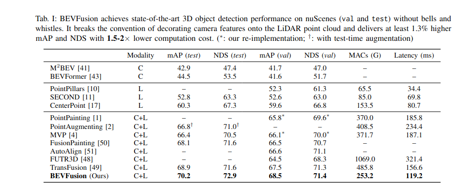

学习笔记

# 整体流程
## 1. build_datasets()
*输入*: cfg。包含信息
*输出*: the capabilities of class datasets which can be used by dataloader.
 [the pipeline of build datasets](https://chat.deepseek.com/a/chat/s/b52f8ce2-da1e-4487-b5f8-51787916e1ac)
## 2. 模块视角转换vtransform
主要查看的是DepthLSSTransform模块

 # 日常测试
 ## 关于各个模块耗时
 相机特征提取+视角转换耗时 0.1576s(extract_t:0.0090, vtransform: 0.1513)
 lidar特征提取 0.0524s
 fuser模块 0.0004s
 head模块0.0034s
 **其中视角转换耗时占总共时间约70\%**

 # 榜单
 
 mAP达到了70%, crazy.

